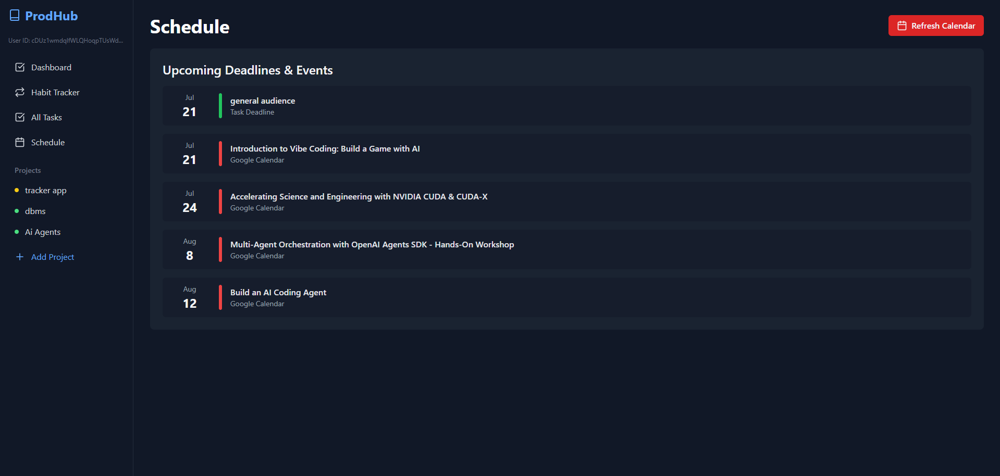

## ProdHub: Empowering Your Productivity

**Take control of your growth—professionally, personally, and daily.**  
ProdHub is a modern, all-in-one web application built to help you organize, achieve, and grow. Seamlessly manage projects, tasks, habits, and your calendar from a single, intuitive platform—all with smart AI-powered features and robust security.

**Try ProdHub Now**  
We are available at: [https://my-productivity-hub-5a3ba.web.app/](https://my-productivity-hub-5a3ba.web.app/)



### Key Features

**Dashboard Overview**  
Get a snapshot of your productivity: overdue tasks, upcoming deadlines, and overall progress—all at a glance.

**Project Management**  
Track everything from courses and conferences to personal projects. Each project gets its own page with a dynamic progress bar that updates as you complete tasks.

**Task Management**  
Break down projects into actionable steps. Set priorities (High, Medium, Low), due dates, and check off completed tasks with ease.

**AI-Powered Planning**  
ProdHub uses the Gemini API to generate smart task lists for new projects—optimized with your project title and synced Google Calendar events for context-aware suggestions. (Google Gemini 2.5 Pro Integrated)

**Habit Tracker**  
Build better routines. Set daily habits, check them off, and watch your consistency grow over time.

**Unified Schedule**  
See all your project deadlines, task due dates, and Google Calendar events beautifully organized in one timeline—no more switching apps.

**Secure Calendar Integration**  
Sync your Google Calendar securely and privately. ProdHub only reads events—your data stays yours.

**Persistent, Private Data**  
Everything you add is saved in real time to your secure Firebase account, so your information is always up to date and accessible wherever you are.

**Safe Sign-In**  
Log in with Google or email. ProdHub prioritizes your privacy and security every step of the way.

### Technology

ProdHub is built for speed, reliability, and a great user experience.

- **Frontend:** React.js
- **Backend & Database:** Firebase (Firestore, Authentication)
- **Styling:** Tailwind CSS
- **AI Integration:** Google Gemini API
- **Calendar Integration:** Google Calendar API via Google Identity Services

### Get Started with ProdHub

Follow these steps to run ProdHub locally and customize it for your workflow.

#### Prerequisites

- **Node.js** (v18 or later): [Download Here](https://nodejs.org/)
- **Firebase CLI** (install globally):  
  `npm install -g firebase-tools`
- **Google Account** (for Firebase and Google Cloud projects)

#### 1. Clone the Repository

```sh
git clone https://github.com/Rupesh4604/my-productivity-hub.git
cd my-productivity-hub
```

#### 2. Install Dependencies

```sh
npm install
```

#### 3. Set Up Firebase

- **Create a Firebase project** at the [Firebase Console](https://console.firebase.google.com/).
- **Enable Firestore:** Go to **Build > Firestore Database** and create a database in Production mode.
- **Update Firestore Rules:** In the **Rules** tab, paste:

  ```
  rules_version = '2';
  service cloud.firestore {
    match /databases/{database}/documents {
      match /artifacts/{appId}/users/{userId}/{document=**} {
        allow read, write: if request.auth != null && request.auth.uid == userId;
      }
    }
  }
  ```

- **Enable Authentication:** Go to **Build > Authentication**, click **Get Started**, and enable Google and Email/Password sign-in.

#### 4. Google Cloud Platform & API Keys

- **Google Calendar:**  
  Enable the Google Calendar API, configure the OAuth consent screen, and get your Client ID using the project documentation.
- **Gemini API:**  
  Visit [Google AI Studio](https://aistudio.google.com/) to create and copy your Gemini API key.

#### 5. Configure Environment Variables

Create a `.env.local` file in your project root and add:

```env
# FIREBASE CONFIGURATION
REACT_APP_FIREBASE_API_KEY="YOUR_API_KEY"
REACT_APP_FIREBASE_AUTH_DOMAIN="YOUR_AUTH_DOMAIN"
REACT_APP_FIREBASE_PROJECT_ID="YOUR_PROJECT_ID"
REACT_APP_FIREBASE_STORAGE_BUCKET="YOUR_STORAGE_BUCKET"
REACT_APP_FIREBASE_MESSAGING_SENDER_ID="YOUR_SENDER_ID"
REACT_APP_FIREBASE_APP_ID="YOUR_APP_ID"

# GOOGLE API KEYS
REACT_APP_GOOGLE_CLIENT_ID="YOUR_GOOGLE_CLIENT_ID"
REACT_APP_GEMINI_API_KEY="YOUR_GEMINI_API_KEY"
```

Update `src/App.js` to use these variables for your `firebaseConfig`.

#### 6. Run and Deploy

- **Start locally:**  
  `npm start` (opens at `http://localhost:3000`)
- **Build:**  
  `npm run build`
- **Deploy:**  
  `firebase deploy` (ensure `firebase.json` is set to use the `build` folder)

### Ready to Supercharge Your Productivity?

ProdHub brings your goals, tasks, habits, and schedule into one powerful, secure, and intelligent hub.  
Take the first step toward a more organized, focused, and productive life.

**Start your journey with ProdHub today.**

## Our Organization

OpenSourceEnv is a dedicated initiative focused on democratizing access to high-quality education in various domains of technology. Our mission is to provide comprehensive resources that empower learners at all levels to master new skills and technologies. We are committed to fostering an inclusive learning environment where everyone can thrive.

Community Page: [OpenSourceEnv Teamspace](https://www.notion.so/Teamspace-Home-913399bce8764b36ad8e928a0083af45)

Github: https://github.com/openSourceEnv

## License
This project is licensed under the MIT License. For details, refer to the LICENSE.md file. You can find terms & conditions and other privacy related details at [prodhub-info](https://github.com/Rupesh4604/prodhub-info/tree/main).

## Contact
Created by: Rupesh Kumar Yadav Mediboyina, Email: rupesh32003@gmail.com

LinkedIn: www.linkedin.com/in/mediboyina-rupesh-kumar-yadav-8b7a14205
